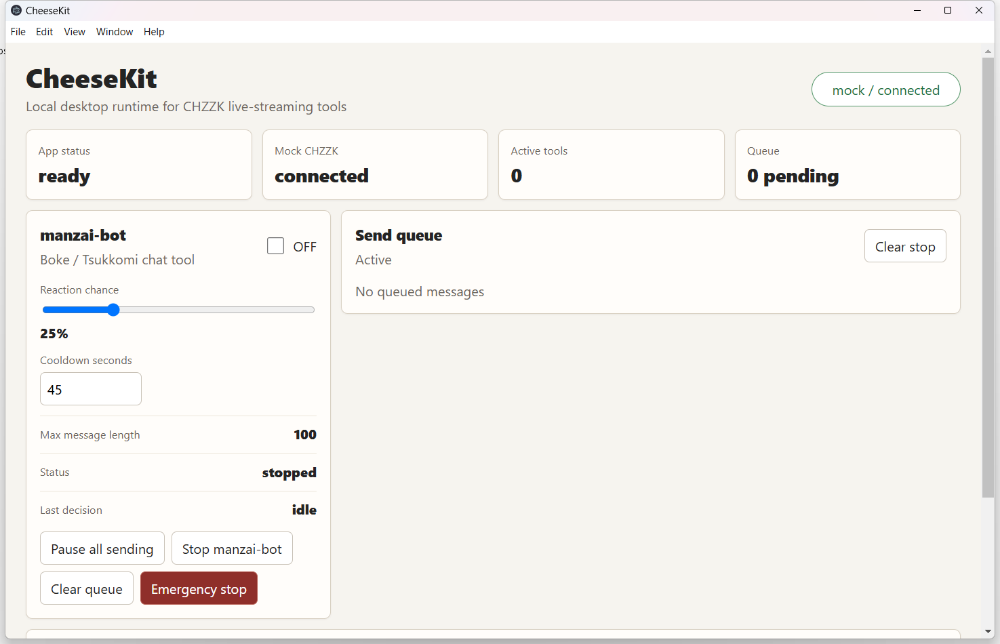
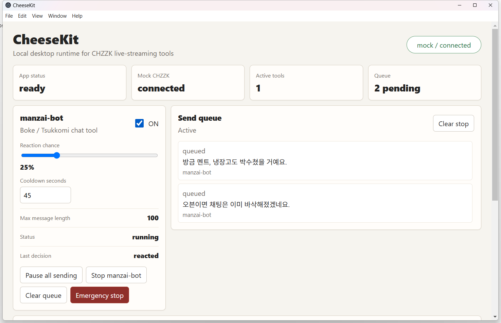
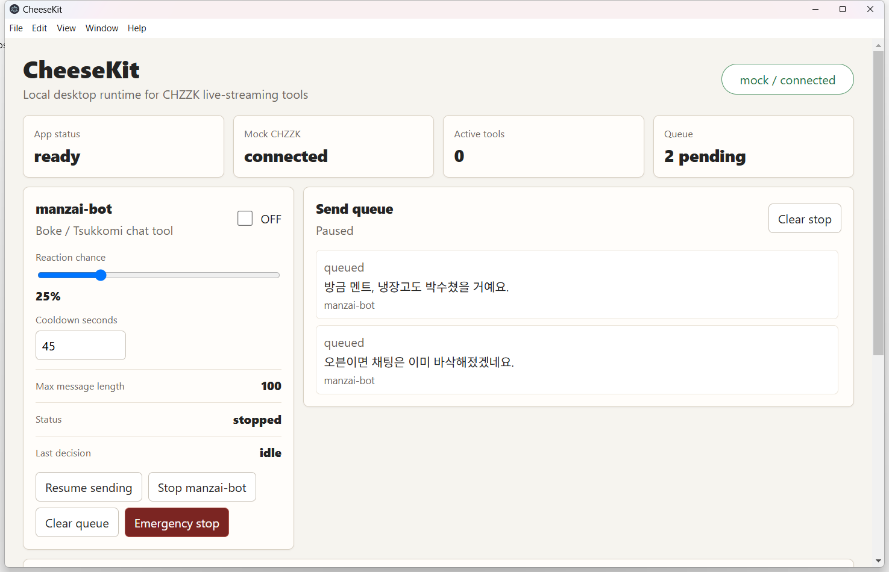

# CheeseKit

> Local-first CHZZK livestream tooling runtime with a safe internal bot library.

[English](README.md) | [한국어](docs/readme/README.ko.md) | [中文](docs/readme/README.zh-CN.md) | [日本語](docs/readme/README.ja.md)

| Area | Detail |
|---|---|
| Platform | Electron desktop app |
| Stack | TypeScript, React, pnpm workspace |
| Current adapter | Mock CHZZK adapter |
| First tool | `manzai-bot`, a short Korean-first reaction bot |
| Safety stance | Root-owned send queue, cooldown, duplicate protection, emergency stop |

## Preview

The desktop root app starts with a mock CHZZK connection and a controllable internal bot card.



<details>
<summary>View full demo walkthrough</summary>

The demo flow turns on `manzai-bot` with the mock CHZZK adapter connected, then confirms that automated reaction messages are queued.

1. Run `pnpm install`.
2. Run `pnpm dev`.
3. Click the checkbox on the `manzai-bot` card to switch it `ON`.
4. Adjust `Reaction chance` and `Cooldown seconds`.
5. Confirm that automated reaction messages appear in the `Send queue`.
6. Click `Emergency stop` when the bot needs to stop immediately.

The first screen shows the connection state and the automated reaction bot card. The `manzai-bot` checkbox is still off.


After `manzai-bot` is enabled, automated reaction messages appear in the `Send queue`. This screen also shows the current chance and cooldown settings.



Use `Emergency stop` to halt the queue and stop the bot state immediately.



</details>

## Quick Start

```bash
pnpm install
pnpm dev
```

## Documentation

- [Full English README](docs/readme/README.en.md)
- [한국어 README](docs/readme/README.ko.md)
- [中文 README](docs/readme/README.zh-CN.md)
- [日本語 README](docs/readme/README.ja.md)

## Notes

The root README is intentionally short. Detailed setup, architecture, limitations, and localized walkthroughs live in the linked README files.
