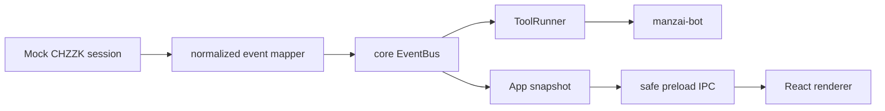
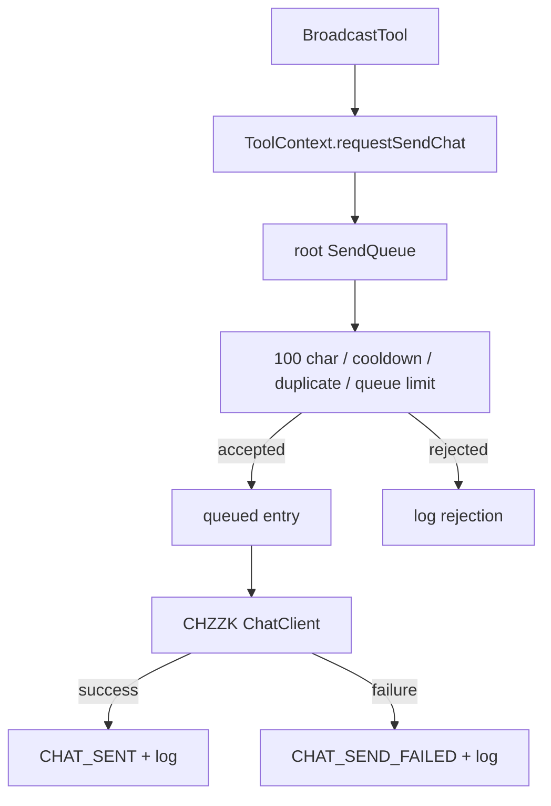

# CheeseKit Architecture

## Root App Responsibilities

The CheeseKit root app is the authority boundary. In v0.1 it runs in Electron main process code and owns:

- CHZZK authentication interfaces and future token handling.
- CHZZK session and chat adapters.
- Normalized event creation.
- Event bus publication.
- Tool registration and lifecycle.
- Send queue validation, cooldown, duplicate protection, and rate limiting.
- Logging and observable app state.
- Safe IPC commands for the renderer.
- Global emergency stop, send pause/resume, queue clear, and per-tool stop.

The renderer does not receive CHZZK tokens, raw clients, database handles, or Electron internals. It receives snapshots and sends commands over preload-exposed IPC methods.

## Library Responsibilities

Internal libraries implement `BroadcastTool` from `packages/tool-sdk`:

```ts
interface BroadcastTool {
  id: string;
  name: string;
  version: string;
  init(context: ToolContext): Promise<void>;
  start(): Promise<void>;
  stop(): Promise<void>;
  onEvent(event: BroadcastEvent): Promise<void>;
  getStatus(): ToolStatus;
}
```

A library can only use `ToolContext`:

- logger
- config reader
- `requestSendChat()`
- LLM provider
- clock/random utilities

`ToolContext` intentionally does not expose raw CHZZK clients, access tokens, refresh tokens, Electron APIs, or direct database handles.

## Why manzai-bot Cannot Call CHZZK Directly

`manzai-bot` is a creative reaction library, not an integration owner. If it could call CHZZK directly, every future library would need its own auth, token, retry, safety, and rate-limit logic. That would make anti-spam rules inconsistent and would risk exposing credentials to tool code.

The root app centralizes the dangerous operations:

1. Receive raw adapter events.
2. Map them to normalized `BroadcastEvent` objects.
3. Route events to active tools.
4. Accept tool send requests.
5. Enforce safety and platform limits.
6. Send through the CHZZK chat adapter.

This lets future libraries remain replaceable and testable.

## Event Flow



Current normalized events:

- `CHAT_RECEIVED`
- `LIVE_STARTED`
- `LIVE_ENDED`
- `TOOL_STARTED`
- `TOOL_STOPPED`
- `SEND_CHAT_REQUESTED`
- `CHAT_SENT`
- `CHAT_SEND_FAILED`
- `SYSTEM_ERROR`

## Send Queue Flow



Default send queue settings:

- `maxMessageLength: 100`
- `cooldownSeconds: 45`
- `maxQueuedMessages: 10`
- `duplicateWindowSeconds: 120`
- `longMessagePolicy: "truncate"`

The root queue is the final enforcement point even if a tool tries to request an oversized message.

## manzai-bot Flow

1. Receive `CHAT_RECEIVED`.
2. Ignore commands starting with `!`, `/`, or `#`.
3. Ignore streamer messages when configured.
4. Skip empty, too short, or unsafe messages.
5. Apply `reactionChance`.
6. Ask the LLM provider for one boke line and one tsukkomi line.
7. Sanitize and keep lines short.
8. Request sending through `ToolContext.requestSendChat()`.

The package depends only on `@cheesekit/tool-sdk`.

## Future Extension Points

- Add real CHZZK OAuth by implementing typed clients in `packages/chzzk-adapter`.
- Add secure local credential storage before any real token flow.
- Replace the mock session source without changing `manzai-bot`.
- Add more libraries by registering additional `BroadcastTool` instances in the root runner.
- Add persistent settings/logs through `packages/storage`.
- Add a real LLM provider through `packages/llm-gateway` without changing the tool SDK.
